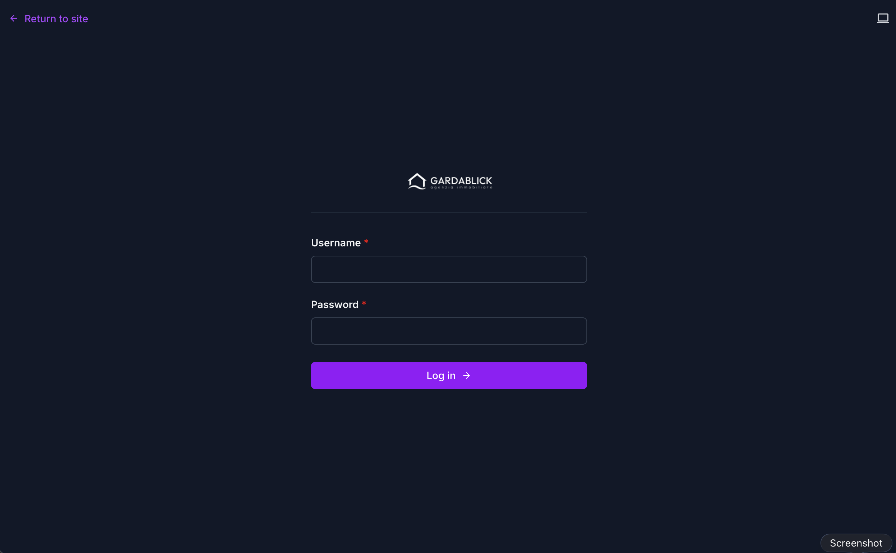
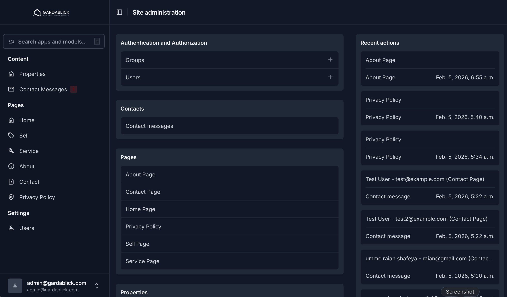

# Gardablick Immobilien

Real estate agency website for **Gardablick Immobilien Srl**, based on Lake Garda, Italy. Built with Django (backend + server-rendered templates) and Tailwind CSS.

---

## Screenshots

### Homepage

<p align="center">
  
</p>

> The public-facing homepage featuring Lake Garda hero imagery, property search filters, cookie consent modal, and featured property listings.

### Admin Login

<p align="center">
  
</p>

> Custom branded login page powered by Django Unfold with the Gardablick logo and dark theme.

### Admin Dashboard

<p align="center">
  
</p>

> Full-featured admin panel for managing properties, contact messages, CMS pages, translations, and user settings.

---

## Project Structure

```
gardablick/
├── backend/                  # Django project
│   ├── config/               # Django settings, URLs, WSGI
│   ├── properties/           # Property listings app
│   ├── contacts/             # Contact form messages app
│   ├── pages/                # CMS pages app (homepage, services, about, etc.)
│   ├── translations/         # i18n translation API (IT/EN/DE)
│   ├── static/               # Admin-specific static files
│   ├── staticfiles/          # Collected static files (served by Django)
│   ├── templates/            # Admin template overrides (Unfold)
│   ├── media/                # User-uploaded media (property images)
│   ├── db.sqlite3            # SQLite database
│   ├── manage.py
│   └── requirements.txt
├── cms_templates/            # Frontend templates & assets
│   ├── templates/            # Django HTML templates
│   │   ├── base.html         # Base layout
│   │   ├── index.html        # Homepage
│   │   ├── immobili.html     # Property listings
│   │   ├── property-detail.html
│   │   ├── vendi.html        # Sell your property
│   │   ├── servizi.html      # Services
│   │   ├── chi-siamo.html    # About us
│   │   ├── contatti.html     # Contact
│   │   ├── privacy-policy.html
│   │   └── includes/         # Reusable components
│   │       ├── header.html
│   │       ├── footer.html
│   │       ├── cookie-consent.html
│   │       └── page-loader.html
│   └── static/gardablick/    # CSS, JS, images
│       ├── css/
│       ├── js/
│       └── images/
└── task.md
```

## Features

- **Multi-language support** (Italian, English, German) with client-side i18n
- **Property listings** with filtering by location, price range, and property type
- **Property detail pages** with image gallery, map, and contact form
- **Contact forms** on multiple pages (Contact, Sell, Property Detail)
- **Cookie consent modal** (GDPR compliant, Cookiebot-style)
- **Page transition loader** with animated house icon
- **Responsive design** (mobile-first with Tailwind CSS)
- **Admin panel** powered by Django Unfold

---

## Getting Started

### Prerequisites

- Python 3.12+
- pip

### 1. Clone the Repository

```bash
git clone https://github.com/bracketcoder/gardablick.git
cd gardablick
```

### 2. Set Up the Virtual Environment

```bash
cd backend
python3 -m venv venv
source venv/bin/activate    # macOS/Linux
# venv\Scripts\activate     # Windows
```

### 3. Install Dependencies

```bash
pip install -r requirements.txt
```

### 4. Run Database Migrations

```bash
python manage.py migrate
```

### 5. Create a Superuser (if starting fresh)

```bash
python manage.py createsuperuser
```

### 6. Start the Development Server

```bash
python manage.py runserver
```

The site will be available at **http://localhost:8000**

---

## Admin Panel

| Field    | Value                              |
|----------|------------------------------------|
| URL      | http://localhost:8000/theadmin/     |
| Username | `admin@gardablick.com`             |
| Password | `TheAdmin@12`                      |

The admin panel uses [Django Unfold](https://github.com/unfoldadmin/django-unfold) for a modern UI. From the admin you can manage:

- **Properties** - Add, edit, delete property listings with images
- **Contact Messages** - View messages submitted through contact forms
- **Pages** - Edit CMS page content (homepage, services, about, etc.)
- **Translations** - Manage i18n translation strings

---

## Database

The project uses **SQLite** for simplicity. The database file is located at:

```
backend/db.sqlite3
```

### Database Configuration (in `backend/config/settings.py`)

```python
DATABASES = {
    "default": {
        "ENGINE": "django.db.backends.sqlite3",
        "NAME": BASE_DIR / "db.sqlite3",
    }
}
```

To switch to PostgreSQL or another database, update the `DATABASES` setting and install the appropriate driver (e.g., `psycopg2` for PostgreSQL).

### Reset Database

```bash
cd backend
rm db.sqlite3
python manage.py migrate
python manage.py createsuperuser
```

---

## Static Files

Static files are organized in two locations:

- **`backend/static/`** - Admin-specific assets (logo, custom admin CSS/JS)
- **`cms_templates/static/gardablick/`** - Frontend assets (CSS, JS, images)

Both are configured in `STATICFILES_DIRS` and collected into `backend/staticfiles/` for serving.

To collect static files (for production):

```bash
cd backend
python manage.py collectstatic
```

---

## API Endpoints

| Endpoint                          | Method | Description                     |
|-----------------------------------|--------|---------------------------------|
| `/api/properties/`                | GET    | List properties (paginated)     |
| `/api/properties/<id>/`          | GET    | Property detail                 |
| `/api/translations/<locale>/`    | GET    | Translation strings (it/en/de)  |
| `/api/contact/`                   | POST   | Submit contact form             |
| `/api/pages/home/`               | GET    | Homepage CMS content            |

### Property Filters

```
/api/properties/?location=Salò&price_min=300000&price_max=600000&property_type=villa&sort=price_asc
```

---

## Tech Stack

- **Backend**: Django 5.x, Django REST Framework
- **Admin**: Django Unfold
- **Frontend**: Server-rendered Django templates, Tailwind CSS
- **Database**: SQLite (default)
- **i18n**: Custom client-side translation system (IT/EN/DE)

---

## License

All rights reserved. &copy; 2025 Gardablick Immobilien Srl.

Web Vision by [Widev Srl](http://www.widev.it/)
